# RECsysX: collaborative filtering vs. graph-based recommendation on MovieLens-1M

Project report. Every number in this report comes from a file in `results/tables/` written by
the scripts listed in the README. Tables between `<!-- table:... -->` markers are copied in
automatically by `scripts/update_docs.py`, so they cannot drift from the result files.

Contents: 1 Motivation · 2 Problem formulation · 3 Dataset · 4 EDA · 5 Preprocessing ·
6 Feature engineering · 7 Popularity baselines · 8 Matrix factorisation · 9 Two-tower ·
10 FAISS · 11 Graph construction · 12 Node2Vec · 13 GraphSAGE · 14 GAT (+ LightGCN) ·
15 Link prediction · 16 Ranking · 17 Hybrid · 18 Cold-start · 19 Sparsity · 20 Personalization ·
21 Diversity · 22 Exposure · 23 Evaluation · 24 Main results · 25 Ablations · 26 Error analysis ·
27 Final model selection · 28 Limitations · 29 Conclusion

## 1. Motivation

Graph neural networks are a standard tool in recommender-systems papers. The usual argument is
that message passing over the user-item graph captures collaborative signal that plain matrix
factorisation misses, especially for users and items with few interactions. I wanted to check
that claim on a dataset I can fully control:

- baselines tuned with the same budget
- an evaluation that does not leak future information
- cold-start and sparse data looked at separately instead of through one averaged number

## 2. Problem formulation

Implicit-feedback top-K recommendation. A rating of 4 or 5 is a positive interaction. Given
everything that happened before a cutoff time T, the system produces for each user a list of K
movies the user has not rated before T. A list is good if it contains the movies the user rated
positively after T.

The same problem is link prediction on the bipartite user-item graph. The training positives are
the observed edges, and the task is to rank the edges that appear after T above the ones that do
not. Every trained model in the project optimises a link-prediction objective (BPR or a sampled
softmax over positive edges against negative samples) and is evaluated with ranking metrics over
the full catalog.

Main question: **does graph-based representation learning improve recommendation and cold-start
performance compared with conventional collaborative filtering?**

## 3. Dataset

MovieLens-1M has 1,000,209 ratings (1-5 stars) from 6,040 users on 3,706 rated movies, collected
in 2000-2003. It includes user demographics (gender, age group, occupation, zip) and movie
metadata (title, release year, 18 genres). `data/README.md` has the comparison with other datasets
that led to this choice, the license (no redistribution, so the data is downloaded by a script)
and the full split statistics.

## 4. EDA

Notebook `notebooks/01_eda.ipynb`, figures `results/figures/eda_*.png`.

- Density is 4.47%. Ratings per user: median 96 (min 20, max 2,314). Ratings per movie: median
  123.5, and 446 movies have fewer than 10 ratings.
- Strong long tail: the 20% most rated movies receive 65% of the ratings.
- 57.5% of ratings are 4 or 5 (positives). Older users rate positively more often: the positive
  rate is about 0.53-0.56 for 18-24 year olds and 0.63-0.71 for the 56+ group.
- The time dimension is unusual. 63% of the users gave *all* their ratings within 24 hours of
  their first one, and the median active span is about an hour. Activity peaks in November 2000
  and is small after 2001.
- 82 of the 100 most liked movies after the cutoff are also in the top 100 before it. Half of
  the 18 newcomers are 2000 releases. Popularity is mostly stable, with a recency component.

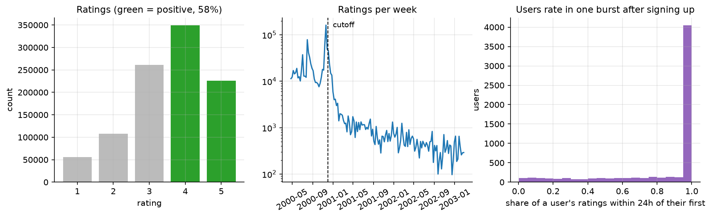

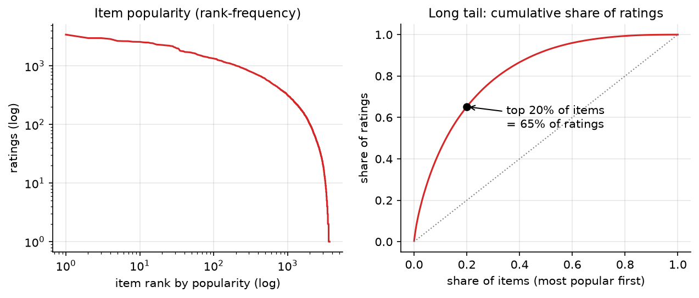

## 5. Preprocessing

- Contiguous ids. The 177 never-rated movies are dropped. No duplicates or missing values were
  found.
- Positives are ratings >= 4. Ratings of 1-3 count as "seen", so they are filtered from the
  candidates, and the ranking features use them. They are not graph edges or training targets.
- The release year is parsed from the title, and titles are normalised ("Matrix, The" becomes
  "The Matrix").

Split. Users rate in one burst at sign-up, so a plain train/val/test split on time behaves
badly. In an 80/10/10 version, 611 of the 1,103 validation users had no history, while only 29 of
the 1,188 test users were in that situation (`results/tables/eda_extra.json`). The split used instead:

- one global cutoff at the 80% quantile of all timestamps (2000-12-02 14:52 UTC)
- everything before the cutoff is training data: 800,164 ratings, 463,017 of them positive
- the 1,762 users with positives after the cutoff are split 50/50 into validation and test users,
  stratified by group: warm (>20 training positives), sparse (1-20) and cold (0)

Validation and test users come from the same period and population. Hyper-parameters, early
stopping and every other choice use validation users only. The test users are only used to report
results. There are 881 test users: 487 warm, 73 sparse and 321 cold.

One consequence matters when reading the results. 36% of the test users are cold users with many
targets (median 51), so averages over all users are pulled towards how a model handles users it
knows nothing about. Results are therefore always reported per group as well.

## 6. Feature engineering

Content features (model inputs).

- Movies: 18 genre flags, standardised release year, decade one-hot and a 16-dimensional SVD of
  the title tf-idf (46 dims).
- Users: one-hot gender, age group, occupation and first zip digit (40 dims).

They are used by the two-tower model, the hybrid GNN and the demographic popularity baseline.

Ranking features (`src/recsysx/features/ranking.py`), 32 per (user, candidate) pair:

| group | features | why |
|---|---|---|
| user | number of ratings and positives (log), mean and std of ratings, days since last rating, active days, genre entropy, mean popularity of liked movies, cold flag, gender, age | how active, how picky and how mainstream the user is |
| item | popularity (all-time and last 30 days before the cutoff, log), number of ratings, Bayesian-smoothed mean rating, release year, number of genres, cold flag | quality and trend signals the embeddings do not see directly |
| pair | retrieval score and rank, dot-product scores of every trained model (MF, two-tower, Node2Vec, GraphSAGE, GAT, LightGCN, hybrid), ItemKNN score, cosine between the user's genre profile and the movie's genres, the user's (shrunk) mean rating for the movie's genres, popularity gap, release-year gap | agreement between models, explicit genre match |

Leakage rule: every statistic uses only ratings before the cutoff, the model scores come from
models trained only on pre-cutoff positives, and the labels come from after the cutoff. A unit
test (`tests/test_ranking_rerank.py::test_features_do_not_use_eval_period`) changes every rating
after the cutoff and checks that no feature changes. Section 16 discusses a subtler problem with
*where the ranker's labels come from*, which this test cannot catch.

## 7. Popularity baselines

Three variants, all computed from training positives only, with already-rated movies removed:

- all-time popularity
- recent popularity: positives in the last 7 days before the cutoff. The window was chosen on
  validation from 7, 30 and 90 days.
- demographic popularity: popularity inside the user's gender x age-group segment
  (14 segments). This is the simplest model that gives a brand-new user something other than the
  global list.

A small global-popularity term breaks ties.

## 8. Matrix factorisation

`src/recsysx/models/mf.py`. 64-dimensional user and item embeddings, score = dot product, BPR loss
with one uniformly sampled negative per positive, Adam, batch 4,096. A sampled negative is drawn
again if it hits one of the user's training positives. Movies the user rated low are allowed as
negatives. L2 regularisation is applied to the embeddings of each batch.

One detail turned out to matter. The embedding table has an extra "unknown user" row, trained by
replacing 10% of the user ids in each batch with it (id dropout). At inference every user without
training positives uses that row. Without it, cold users are scored with a random, never-trained
vector. In the tuning run without id dropout, validation recall@20 for cold users drops from
0.113 to 0.013. The same mechanism is used in the two-tower model and all GNNs, so every model
has a defined behaviour for unseen users.

Training runs for up to 200 epochs. Validation recall@20 is computed after every epoch, with early
stopping at patience 20. That is the same for MF, the two-tower model and all GNNs; a Node2Vec epoch
is a full pass of random walks, so it uses patience 5 out of 30 epochs. The best epoch is restored and saved.
Tuning on validation covered learning rate {1e-3, 5e-3} x L2 {1e-5, 1e-4, 1e-3}, then 4 negatives
and id dropout 0. The defaults (lr 1e-3, L2 1e-4, 1 negative) were best.

## 9. Two-tower retrieval

`src/recsysx/models/two_tower.py`.

- user tower: [64-d user id embedding, 40-d demographics] -> 256 -> 64, L2-normalised
- item tower: [64-d item id embedding, 46-d content vector] -> 256 -> 64, L2-normalised
- loss: in-batch sampled softmax over cosine / temperature. With 4,096 pairs per batch, every
  positive has 4,095 negatives. Popular items appear more often in batches and are punished too
  often as negatives, so the logQ correction (Yi et al., 2019) subtracts log(item frequency) from
  each logit. Duplicate items inside a batch are masked out.
- id dropout of 10% on both towers, so unseen users and items fall back on their features

Tuned: temperature {0.05, 0.1, 0.2} (0.2 selected), logQ on/off, id dropout {0, 0.1, 0.3}.

The logQ correction matters a lot. Without it, validation recall@20 falls from 0.119 to 0.024.
The model then learns to recommend obscure movies, because it was taught that popular ones are
usually negatives.

## 10. FAISS

`src/recsysx/retrieval/faiss_index.py`, experiment `scripts/run_retrieval.py`.

Item vectors of a trained model go into an inner-product index, and user vectors are the queries.
For the two-tower model the vectors are normalised, so this is cosine similarity.

Already-seen movies have to be removed per user. FAISS cannot filter a different id set per query
in one batched search without extra machinery, so the search over-fetches k = N + (largest history
in the batch) and drops the seen items afterwards. With 3,706 movies that is cheap. With a much
larger catalog the history used for filtering would need to be capped.

Three index types were compared on the selected retriever:

- exact `IndexFlatIP`
- `IndexIVFFlat`: 64 lists, nprobe 1, 4 and 16
- `IndexHNSWFlat`: M = 8 and 32

A unit test checks that the exact index returns the same top-N as a brute-force PyTorch top-k with
the same filter. The retrieval experiment repeats that check on the real data: the overlap of
their top-100 lists is 1.0 for every model.

## 11. Graph construction

`src/recsysx/graph/build.py`. One homogeneous graph: users are nodes 0..6039, movies are
6040..9745, and every training positive is an undirected edge. That gives 463,017 edges and a
bipartite density of 2.07%. Low ratings are not edges: a "watched and hated it" edge would make
the user look similar to the people who loved the movie.

Statistics (`results/tables/graph_stats.json`):

- User degree: median 46, max 1,209.
- Movie degree: median 34, max 2,423.
- 644 users and 237 movies are isolated (no training positives). Everything else is a single
  connected component.
- The graph is extremely dense at two hops. A typical user shares at least one liked movie with
  4,915 of the 5,395 other users who have a training history.

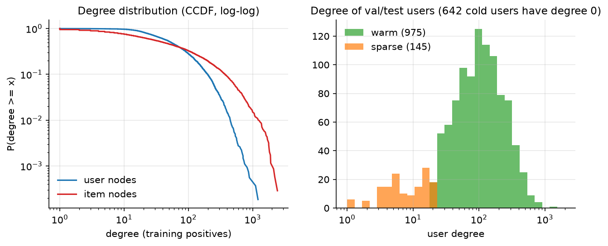

`notebooks/02_graph_analysis.ipynb` shows what this means for neighbourhood averaging. Give every
movie its genre vector and propagate with mean aggregation. The mean pairwise cosine similarity
between users is then 0.71 after one step, 0.986 after three and 0.999 after five; random movie
pairs are at 0.22. Repeated averaging makes users indistinguishable very quickly on this graph.

## 12. Node2Vec

`src/recsysx/models/node2vec.py`, using PyG `Node2Vec` with `torch_cluster` biased random walks.
PyG 2.6.1 is pinned because 2.7+ needs a `pyg-lib` build that does not exist for Windows with
torch 2.5.

Settings: 64-d embeddings, 10 walks of length 20 per node, 1 negative per positive, SparseAdam.
Tuning tried walk length 40, context window 5 vs 10, and p in {0.25, 1, 4} with q = 1. Selected:
p = 0.25, q = 1, context 5, walk length 20.

The recommendation score is the dot product of user and movie embedding. Two alternatives were
tested on validation:

- cosine similarity: much worse (0.057 against 0.106)
- the classic node2vec link-prediction variant, a logistic regression on the Hadamard product
  u * i: about the same as the plain dot product (0.101)

Cold users get the mean user embedding.

The graph is bipartite, so the node after next is always on the same side as the previous node and
can never be its neighbour. Only the ratio of the return weight 1/p to the "go anywhere else"
weight 1/q matters. On the training graph 0.9% of walk steps return to the previous node with
p = q = 1, 1.0% with p = 4 and 3.4% with p = 0.25 (`results/tables/graph_extra.json`). Most nodes have
high degree, so returns are rare and p = 4 cannot reduce them further. The validation results for the three p values were
within 0.001 of each other (0.1017, 0.1027, 0.1025).

Node2Vec never sees "user liked item" as a training target, only co-occurrence in walks. It
answers whether graph structure alone, without a recommendation loss, gives useful embeddings.

## 13. GraphSAGE

`src/recsysx/models/gnn.py`. Input node features are learned 64-d id embeddings (plus the
unknown-user row), followed by `SAGEConv` layers with ReLU and dropout between layers. The final
embedding combines the layer outputs including layer 0 (mean, or concatenation + linear), and the
score is a dot product. Training is full-graph: every batch of 8,192 positive edges runs one
forward pass over the whole graph, then BPR on (user, positive, sampled negative).

Target-edge removal. The edges of the current batch are removed from the message-passing graph
for that step. Otherwise the model can score (u, i) highly simply because i is one of u's
neighbours, a shortcut that never exists for the future interactions in the evaluation. At
inference the full training graph is used.

What went wrong first (full log: `results/logs/gnn_training_diagnostics.txt`). In the first
tuning pass every GraphSAGE config stopped after ~12 epochs at a validation recall@20 of ~0.099.
That is popularity level, far below MF (0.117). I stopped the tuning and trained variants for a
fixed number of epochs without early stopping (`scripts/debug_gnn_training.py`). Two separate
problems came out of that.

1. *Early stopping was too impatient.* The GraphSAGE validation curve stays flat for many epochs
   and improves later: the default config reached 0.1056 at epoch 33, so patience 10 cut it off.
   Patience is now 20 for MF, the two-tower model and the GNNs. The same diagnostics showed that LightGCN-style
   propagation (no weight matrices, no nonlinearity) with exactly the same training reached 0.119.
   That is why LightGCN was added as a reference model (section 14b).
2. *The unknown-user embedding was trained in the wrong condition.* With patience 20, GAT still
   collapsed. After ~12 epochs on a loss plateau the training loss dropped, and the overall
   validation recall fell from 0.096 to 0.066. Logging the metric per user group showed what was
   happening:
   - warm users got *better* at that moment (0.086 -> 0.103)
   - cold users fell from 0.111 to 0.004

   Cold users are represented by the unknown-user row. Id dropout trained it by hiding the id of
   10% of the users per step, but those users kept their edges. A real cold user has the unknown
   id *and* no edges, a combination the model never saw during training. MF and LightGCN map it to
   a scaled copy of the trained row and were fine; the weighted GAT/GraphSAGE layers produced
   garbage. Since 36% of the validation users are cold, early stopping kept the epoch before the
   transition, i.e. a popularity-like model for everybody.

   The fix (`cold_simulation`): a user whose id is dropped in a step also loses all edges in that
   step, and the same goes for items in the content models. After the fix, cold users stay at
   ~0.113 during training and GAT reaches 0.114 instead of 0.096. All GNN tuning was redone with
   the fix, and the old behaviour is one of the ablations in section 25.

I first suspected overfitting through unregularised layer weights and tried L2 on the output
embeddings, which changed nothing. The lesson for me was to log validation metrics per user group
from the start. An averaged metric hid the fact that one group improved while another broke.

Tuning stages. Each stage scores candidates by validation recall@20 and starts from the best
config so far:

1. layers {1, 2, 3}
2. L2 1e-3, dropout 0.3 or lr 5e-3
3. max aggregation
4. layer combination {last, concat}
5. dimension 128

Selected: 1 layer, L2 1e-3, concatenated layer outputs (lr 1e-3, mean aggregation, dim 64).

Deeper models start improving later, so 1 layer also benefits from early stopping. The depth
ablation in section 25 re-trains 2 and 3 layers with patience 50 to check this.

## 14. GAT

Same module with `GATConv` layers: heads are concatenated to 64 dims, and self-loops let a node
attend to itself. The input embeddings, loss, batch size, negative sampling, target-edge removal,
cold simulation and early stopping are the same as for GraphSAGE. The tuning stages are the same
too, with the number of heads {1, 8} in place of the aggregation function. Selected: 1 layer,
8 heads of 8 dims, lr 5e-3.

### 14b. LightGCN (reference)

`conv: lgc` in the same module uses PyG `LGConv`, the symmetric-normalised neighbour sum of
LightGCN (He et al., 2020). It has no weights and no nonlinearity, and the layer outputs are
averaged with layer 0. Everything else is identical to the GraphSAGE setup.

It was added after the diagnostics above to separate two questions that GraphSAGE/GAT alone cannot
separate: does the graph propagation not help, or do the learned transformations not help?
Tuned: layers {1, 2, 3}, then lr 5e-3 or L2 1e-3 or L2 1e-5, then dimension 128. Selected: 1 layer,
lr 5e-3.

## 15. Link prediction

All trained models are link predictors by construction (BPR or softmax on positive vs. negative
edges). As a separate check, `scripts/run_analysis.py` scores two sets of pairs and reports
ROC-AUC and average precision:

- the test edges: every positive of every test user after the cutoff
- the same number of random non-edges: movies the user neither rated before nor liked after the
  cutoff

AUC answers the question "is a random true edge scored above a random non-edge?". That is dominated
by the easy negatives (obscure movies). Top-K metrics only care about the first 20 positions.

<!-- table:link -->
| Model | AUC | AP | AUC warm | AUC sparse | AUC cold | test recall@20 |
|---|---|---|---|---|---|---|
| Popularity | 0.8632 | 0.8486 | 0.8550 | 0.8588 | 0.8713 | 0.1004 |
| Popularity (recent) | 0.8603 | 0.8474 | 0.8535 | 0.8525 | 0.8679 | 0.1118 |
| Popularity (demographic) | 0.8699 | 0.8578 | 0.8603 | 0.8693 | 0.8790 | 0.1097 |
| ItemKNN | 0.6921 | 0.6854 | 0.8291 | 0.8081 | 0.8713 | 0.1110 |
| MF-BPR | 0.8736 | 0.8582 | 0.8784 | 0.8687 | 0.8705 | 0.1143 |
| Two-Tower | 0.8693 | 0.8558 | 0.8680 | 0.8559 | 0.8733 | 0.1177 |
| Node2Vec | 0.8003 | 0.7957 | 0.8263 | 0.2958 | 0.8698 | 0.1040 |
| GraphSAGE | 0.8389 | 0.8014 | 0.8501 | 0.8369 | 0.8693 | 0.1123 |
| GAT | 0.8578 | 0.8280 | 0.8694 | 0.8552 | 0.8699 | 0.1139 |
| LightGCN | 0.8692 | 0.8537 | 0.8705 | 0.8690 | 0.8698 | 0.1209 |
| Hybrid (id+content+graph) | 0.8661 | 0.8538 | 0.8625 | 0.8566 | 0.8745 | 0.1224 |
<!-- /table:link -->

The two views disagree:

- Popularity has an AUC of 0.863, almost as high as MF (0.874), but the lowest recall@20.
- ItemKNN has the lowest AUC (0.692). It gives exactly zero to every movie with no co-likes
  with the user's history, so many positives and negatives tie, and AUC punishes ties. Its top 20
  is still competitive.
- GraphSAGE has a lower AUC than MF (0.839 vs. 0.874) at a similar recall.
- Node2Vec has an AUC of 0.30 on sparse users, worse than random. Their embeddings come from
  very few walks and point in arbitrary directions.

Link-prediction AUC is not a good proxy for recommendation quality here, so model selection uses
recall@20.

## 16. Ranking

`scripts/run_ranking.py`, rankers in `src/recsysx/ranking/rankers.py`.

The pipeline: FAISS exact search with the best retriever (by validation candidate recall@200) gives
N candidates per user. The features from section 6 are computed for each candidate, and a ranker
re-orders them. Rankers:

- logistic regression on standardised features (pointwise baseline)
- XGBoost `XGBRanker` with `rank:ndcg` (LambdaMART): up to 1,000 trees, depth 6, learning rate
  0.05, early stopping on NDCG@10
- neural ranker: an MLP 128-64-1 with a listwise softmax loss over each user's candidate list
  (ListNet with several positives), early stopping on NDCG@10

First version. The ranker's training data are the candidates of the *validation* users, with
labels = their positives after the cutoff (the retrieval models never saw those). 80% of the
validation users fit the rankers. The other 20% are used for early stopping and for choosing the
ranker and N. That choice uses the same end-to-end metric as the test evaluation: recall@20 against
all of the user's positives, including the ones the retriever missed.

My initial version selected on NDCG over the retrieved positives only. That was biased towards
small N: a larger candidate set makes the conditional task harder while it improves the actual
end-to-end result.

<!-- table:ranking -->
| N | Ranker | Val. recall@20 (selection) | Test recall@20 | Test NDCG@10 | Test NDCG@20 | Cold users R@20 |
|---|---|---|---|---|---|---|
| 50 | retrieval only | 0.1053 | 0.1209 | 0.3201 | 0.3004 | 0.1151 |
| 50 | logreg | 0.1138 | 0.1240 | 0.3319 | 0.3093 | 0.1176 |
| 50 | xgb | 0.1179 | 0.1305 | 0.3368 | 0.3155 | 0.1192 |
| 50 | neural | 0.1205 | 0.1304 | 0.3243 | 0.3089 | 0.1179 |
| 100 | retrieval only | 0.1053 | 0.1209 | 0.3201 | 0.3004 | 0.1151 |
| 100 | logreg | 0.1182 | 0.1260 | 0.3288 | 0.3094 | 0.1182 |
| 100 | xgb | 0.1249 | 0.1380 | 0.3406 | 0.3197 | 0.1191 |
| 100 | neural | 0.1254 | 0.1391 | 0.3292 | 0.3119 | 0.1203 |
| 200 | retrieval only | 0.1053 | 0.1209 | 0.3201 | 0.3004 | 0.1151 |
| 200 | logreg | 0.1198 | 0.1257 | 0.3258 | 0.3063 | 0.1166 |
| 200 | xgb | 0.1315 | 0.1434 | 0.3488 | 0.3274 | 0.1205 |
| 200 | neural | 0.1281 | 0.1403 | 0.3309 | 0.3142 | 0.1179 |
<!-- /table:ranking -->

Reading the ranking table:

- XGBoost with 200 candidates was selected. Test recall@20 went from 0.1209 (retrieval order) to
  0.1434.
- Logistic regression barely helps.
- The listwise MLP is close to XGBoost.
- More candidates help XGBoost and the MLP, logistic regression stays flat. Candidate recall grows
  faster with N than the ranking gets harder.

Second thought: where do the labels come from? A gain of +19% made me suspicious. In the
XGBoost feature importance, release year (13.5% of the gain) and recent popularity (10%) came
right after the retrieval rank. The validation users' labels lie in the *same period* as the test
users' labels. No test information leaks, but the ranker learns from that period how strongly
"new movie" or "recently popular" predicts a like. A deployed system could not know that yet.

So `scripts/run_ranking_temporal.py` repeats the experiment strictly in time:

- a second cutoff T0 at the 70% quantile (2000-11-22)
- all eight score models retrained on positives before T0, with fixed epochs taken from the main
  runs
- the ranker learns from the 913 users with positives between T0 and the real cutoff
- the ranker is applied unchanged to the validation and test users

<!-- table:temporal -->
| users | ranking | recall@20 | NDCG@20 | warm R@20 | sparse R@20 | cold R@20 |
|---|---|---|---|---|---|---|
| val | retrieval only | 0.1202 | 0.2943 | 0.1230 | 0.1162 | 0.1170 |
| val | xgb trained only on data before the cutoff (strictly temporal) | 0.1304 | 0.3058 | 0.1386 | 0.1359 | 0.1168 |
| test | retrieval only | 0.1209 | 0.3004 | 0.1241 | 0.1254 | 0.1151 |
| test | xgb trained on validation users (same period as test) | 0.1434 | 0.3274 | 0.1584 | 0.1443 | 0.1205 |
| test | xgb trained only on data before the cutoff (strictly temporal) | 0.1329 | 0.3119 | 0.1427 | 0.1355 | 0.1174 |
<!-- /table:temporal -->

The strictly temporal ranker still clearly helps:

- test: +0.012 recall@20 over retrieval alone (0.1329 vs. 0.1209)
- validation: +0.010 (0.1304 vs. 0.1202)

But about 47% of the gain measured with the validation-trained ranker, (0.1434 - 0.1329) /
(0.1434 - 0.1209), came from information about the test period. In the temporal ranker the
retrieval rank becomes more important (22% of gain) and release year less (5%). **The final
pipeline uses the strictly temporal ranker.** The validation-trained one is reported as an
optimistic upper bound.

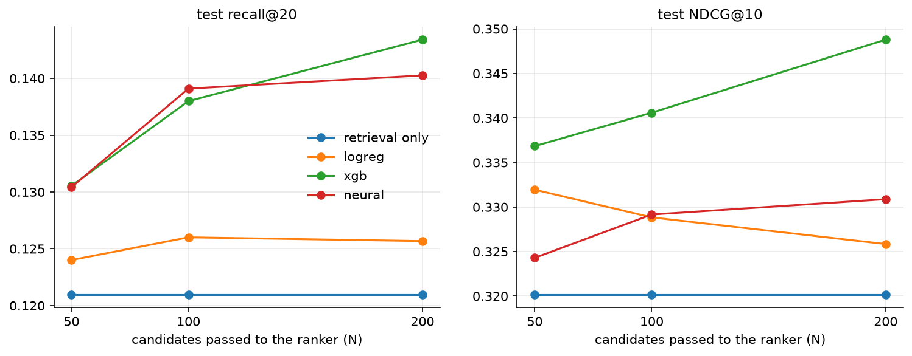

## 17. Hybrid model

The hybrid uses the same GNN module with content added. Node input = id embedding + a 2-layer MLP
projection of the content vector, with separate projections for users and movies. Id dropout
(10%) is applied to items as well, and dropped movies lose their edges for that step (the same
cold simulation as for users). So a movie with no training interactions is represented by its
content plus the "unknown item" row, which is how it was trained.

Stage 1 of its tuning tries the tuned GraphSAGE, GAT and LightGCN configurations with content
added. Validation recall@20 was 0.1170, 0.1153 and 0.1202 respectively. Stage 2 varies the id
dropout rates. Selected: LightGCN propagation, 1 layer, lr 5e-3, id dropout 0.1 on users and items.

The ablation grid is {id, content, id + content} x {no message passing, message passing}. All six
variants are trained with the identical code, loss and budget, 3 seeds each:

| variant | id embedding | content | graph |
|---|---|---|---|
| collaborative only | yes | no | no (MF trained through the GNN code path) |
| content only | no | yes | no |
| id + content | yes | yes | no |
| graph only | yes | no | yes (= LightGCN) |
| content + graph | no | yes | yes |
| hybrid | yes | yes | yes |

## 18. Cold-start

Three separate setups, never merged into one number.

1. Natural user groups in the main split: warm (487 test users), sparse (73) and cold (321).
2. Simulated new items. 10% of the catalog (371 movies, sampled among movies with training
   positives) is removed from training, including from every user's history. All models are
   retrained, then evaluated two ways:
   - ranking *only* the new movies for each user ("which new releases to show")
   - whether the new movies reach the top 100 of the full catalog
3. New-user onboarding. These are cold test users with at least 15 positives after the cutoff
   (298 users). The first 10 positives in time order are the onboarding ratings, and the later
   positives are the targets. For k in {0, 1, 3, 5, 10} the first k onboarding ratings are revealed
   to the model. Users, targets and the seen-item filter are identical for every k, so the only
   thing that changes is what the model knows. How each model uses the revealed ratings without
   retraining:
   - GNNs: add the k edges to the graph and recompute the embeddings (inductive)
   - MF, two-tower, Node2Vec: fold-in. A free user vector is fitted with BPR against the frozen
     item vectors, starting from the model's cold-user vector.
   - ItemKNN: item-item scores of the revealed movies
   - popularity models: ignore them (apart from not recommending them again)

Two bugs in my first version of (3), both fixed:

- The targets were defined as "everything after the k-th rating", so they changed with k, and even
  plain popularity looked worse with more revealed ratings.
- ItemKNN was given the fixed seen-item filter (all 10 onboarding ratings) instead of the k revealed
  ones, so its curve was flat.

Recall@20 per user group in the main split (mean ± std over 3 seeds):

<!-- table:user_groups -->
| Model | warm (n=487) | sparse (n=73) | cold (n=321) |
|---|---|---|---|
| Popularity | 0.0927 | 0.0900 | 0.1144 |
| Popularity (recent) | 0.1116 | 0.0895 | 0.1171 |
| Popularity (demographic) | 0.1055 | 0.0983 | 0.1188 |
| ItemKNN | 0.1081 | 0.1161 | 0.1144 |
| MF-BPR | 0.1168 ± 0.0034 | 0.1067 ± 0.0053 | 0.1122 ± 0.0012 |
| Two-Tower | 0.1209 ± 0.0030 | 0.1314 ± 0.0096 | 0.1098 ± 0.0010 |
| Node2Vec | 0.1096 ± 0.0076 | 0.0174 ± 0.0088 | 0.1152 ± 0.0007 |
| GraphSAGE | 0.1115 ± 0.0004 | 0.1119 ± 0.0040 | 0.1136 ± 0.0028 |
| GAT | 0.1150 ± 0.0031 | 0.1131 ± 0.0025 | 0.1123 ± 0.0003 |
| LightGCN | 0.1249 ± 0.0036 | 0.1327 ± 0.0018 | 0.1121 ± 0.0011 |
| Hybrid (id+content+graph) | 0.1262 ± 0.0046 | 0.1350 ± 0.0107 | 0.1138 ± 0.0017 |
<!-- /table:user_groups -->

New items (10% of the movies removed from training, all models retrained, seed 42):

<!-- table:item_cold -->
| Model | Recall@20 among new items | NDCG@20 among new items | Recall@100 of new items, full catalog | Share of new items in top-20 | Overall recall@20 |
|---|---|---|---|---|---|
| Popularity | 0.0358 | 0.0218 | 0.0000 | 0.000 | 0.0975 |
| ItemKNN | 0.0358 | 0.0218 | 0.0000 | 0.000 | 0.1082 |
| MF-BPR | 0.0483 | 0.0306 | 0.0000 | 0.000 | 0.1140 |
| Two-Tower | 0.1260 | 0.0796 | 0.0380 | 0.047 | 0.1073 |
| Node2Vec | 0.0379 | 0.0242 | 0.0087 | 0.035 | 0.0995 |
| GraphSAGE | 0.0373 | 0.0279 | 0.0000 | 0.000 | 0.1071 |
| GAT | 0.0437 | 0.0280 | 0.0000 | 0.000 | 0.1123 |
| LightGCN | 0.0507 | 0.0386 | 0.0000 | 0.000 | 0.1154 |
| Hybrid (id+content+graph) | 0.1356 | 0.1064 | 0.0017 | 0.000 | 0.1185 |
| Content + graph (no id) | 0.1104 | 0.0701 | 0.0021 | 0.001 | 0.1101 |
| Content only | 0.0995 | 0.0619 | 0.0001 | 0.002 | 0.0937 |
<!-- /table:item_cold -->

New users revealing k ratings (recall@20 on their later ratings, 298 cold test users, seed 42):

<!-- table:onboarding -->
| Model | k=0 | k=1 | k=3 | k=5 | k=10 |
|---|---|---|---|---|---|
| Popularity | 0.0986 | 0.0986 | 0.0986 | 0.0986 | 0.0986 |
| Popularity (demographic) | 0.1007 | 0.1007 | 0.1007 | 0.1007 | 0.1007 |
| ItemKNN | 0.0986 | 0.0741 | 0.0847 | 0.0992 | 0.1260 |
| MF-BPR | 0.0951 | 0.0812 | 0.0871 | 0.1006 | 0.1214 |
| Two-Tower | 0.0959 | 0.0738 | 0.0810 | 0.0966 | 0.1221 |
| Node2Vec | 0.0976 | 0.0781 | 0.0804 | 0.1026 | 0.1241 |
| GraphSAGE | 0.0997 | 0.0657 | 0.0947 | 0.1081 | 0.1193 |
| GAT | 0.0951 | 0.0812 | 0.0859 | 0.1099 | 0.1264 |
| LightGCN | 0.0957 | 0.0933 | 0.0933 | 0.0956 | 0.1007 |
| Hybrid (id+content+graph) | 0.0975 | 0.0980 | 0.0970 | 0.1012 | 0.1056 |
<!-- /table:onboarding -->

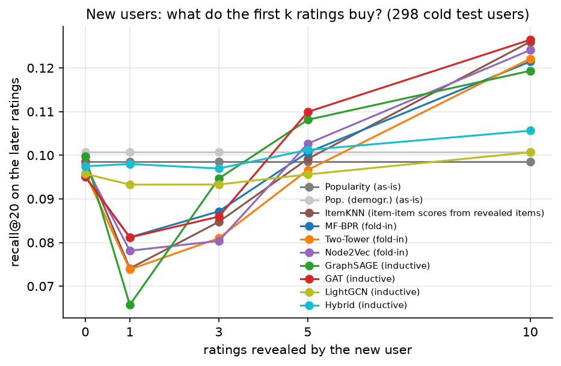

What these tables show:

- No history at all. Every model is between 0.110 and 0.119 recall@20 for the 321 cold test
  users, and the best is the simplest: demographic popularity (0.1188). The learned models
  represent a cold user with one unknown-user vector, which ends up close to the popularity
  direction. The two-tower and the content + graph model use demographics but do not beat
  demographic popularity.
- New movies. When only the new movies are ranked, the content-based models are clearly
  better:
  - hybrid: recall@20 0.136
  - two-tower: 0.126
  - content + graph without ids: 0.110
  - content only: 0.100
  - the id-only models: 0.036-0.051, close to an arbitrary order

  Competing against the full catalog, new movies almost never make it to the top. The best case is
  the two-tower model, which still finds 3.8% of the new-movie positives in its top 100 and gives
  4.7% of its top-20 slots to new movies. The hybrid ranks new movies sensibly *among themselves*
  but scores them below the established movies.
- New users with a few ratings.
  - One revealed rating makes almost every personalized model *worse* than ignoring it (for
    example GraphSAGE 0.0997 -> 0.0657). A single rating is a very noisy profile.
  - At 5 ratings the inductive GAT (0.110) and GraphSAGE (0.108) are clearly above popularity, while
    the fold-in models are about level with it.
  - At 10 ratings the inductive GAT (0.1264) and ItemKNN (0.1260) are best, followed by the fold-in
    of Node2Vec, two-tower and MF (0.121-0.124).
  - LightGCN and the hybrid barely react (0.096 -> 0.101 and 0.097 -> 0.106). Section 26 explains
    why.

## 19. Sparsity

`RecData.with_train_fraction` keeps a uniform random subset of 50%, 20% or 10% of the training
positives (3 seeds; the subsample changes with the seed). Evaluation users, targets and the
seen-item filter are not touched, so every fraction is evaluated on exactly the same test problem.
Every model keeps its tuned hyper-parameters, and early stopping still uses the validation users.
At 10%, a user with the median number of training positives among warm users (68) keeps about 7.
This is also a "make almost everybody sparse" experiment.

<!-- table:sparsity -->
| Model | 100% | 50% | 20% | 10% | kept at 10% |
|---|---|---|---|---|---|
| Popularity | 0.1004 | 0.1014 ± 0.0006 | 0.1000 ± 0.0004 | 0.0982 ± 0.0022 | 98% |
| ItemKNN | 0.1110 | 0.1074 ± 0.0017 | 0.0955 ± 0.0021 | 0.0823 ± 0.0033 | 74% |
| MF-BPR | 0.1143 ± 0.0023 | 0.1106 ± 0.0012 | 0.0974 ± 0.0034 | 0.0888 ± 0.0050 | 78% |
| Two-Tower | 0.1177 ± 0.0027 | 0.1130 ± 0.0019 | 0.1012 ± 0.0034 | 0.0960 ± 0.0015 | 82% |
| Node2Vec | 0.1040 ± 0.0043 | 0.0992 ± 0.0024 | 0.0886 ± 0.0013 | 0.0755 ± 0.0034 | 73% |
| GraphSAGE | 0.1123 ± 0.0010 | 0.0994 ± 0.0042 | 0.0995 ± 0.0019 | 0.0958 ± 0.0027 | 85% |
| GAT | 0.1139 ± 0.0017 | 0.1121 ± 0.0026 | 0.1043 ± 0.0040 | 0.0975 ± 0.0015 | 86% |
| LightGCN | 0.1209 ± 0.0016 | 0.1163 ± 0.0023 | 0.1091 ± 0.0015 | 0.0999 ± 0.0011 | 83% |
| Hybrid (id+content+graph) | 0.1224 ± 0.0025 | 0.1166 ± 0.0026 | 0.1116 ± 0.0015 | 0.1072 ± 0.0021 | 88% |
<!-- /table:sparsity -->

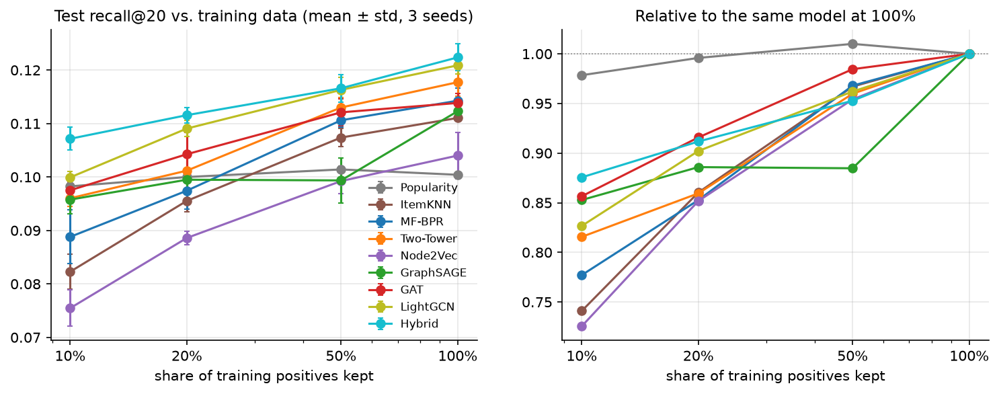

- Graph models degrade more gracefully than MF and ItemKNN. At 10% of the data:
  - MF keeps 78% of its recall@20, ItemKNN 74% and Node2Vec 73%
  - LightGCN keeps 83%, GraphSAGE 85%, GAT 86% and the hybrid 88%
- Ordering at 10%. The hybrid is the only learned model clearly above all-time popularity
  (0.1072 vs. 0.0982). LightGCN is barely above it (0.0999), and every other model is below it.
  With little data, "recommend the popular movies" is very hard to beat, and the models that
  propagate over the graph or use content lose least.
- GraphSAGE is irregular. It drops at 50% but not further at 20%. At 50% one of the three
  seeds stopped on the initial plateau (seed 42: best epoch 2, test recall@20 0.095), which pulls
  the mean down. The same plateau problem from section 13, just less often.

## 20. Personalization

`scripts/run_analysis.py` computes the following for every model's top-10 lists on the test users:

- personalization: 1 minus the mean Jaccard overlap between the lists of 20,000 random user pairs
- the overlap with the global popularity list
- the number of distinct lists
- coverage, novelty and diversity

`results/tables/recommendation_examples.md` shows the lists of three test users chosen by a fixed
rule: the warm user with the most concentrated taste, a sparse user and a cold user.

<!-- table:personalization -->
| Model | personalization@10 | mean Jaccard with popularity list | distinct lists (of 881) | coverage@10 | novelty@10 | genre diversity@10 |
|---|---|---|---|---|---|---|
| Popularity | 0.608 | 1.000 | 473 | 0.032 | 1.62 | 0.677 |
| Popularity (recent) | 0.598 | 0.599 | 470 | 0.026 | 1.69 | 0.598 |
| Popularity (demographic) | 0.752 | 0.589 | 531 | 0.046 | 1.71 | 0.670 |
| ItemKNN | 0.791 | 0.536 | 561 | 0.092 | 1.95 | 0.674 |
| MF-BPR | 0.779 | 0.539 | 561 | 0.141 | 2.03 | 0.672 |
| Two-Tower | 0.946 | 0.184 | 785 | 0.210 | 2.66 | 0.617 |
| Node2Vec | 0.815 | 0.433 | 561 | 0.206 | 2.69 | 0.668 |
| GraphSAGE | 0.817 | 0.403 | 561 | 0.190 | 2.30 | 0.651 |
| GAT | 0.822 | 0.341 | 561 | 0.202 | 2.33 | 0.647 |
| LightGCN | 0.797 | 0.381 | 560 | 0.158 | 2.13 | 0.656 |
| Hybrid (id+content+graph) | 0.877 | 0.312 | 700 | 0.147 | 2.13 | 0.649 |
| Final pipeline | 0.863 | 0.332 | 714 | 0.095 | 2.05 | 0.701 |
<!-- /table:personalization -->

The all-time popularity lists still differ between users (personalization 0.61, 473 distinct
lists of 881) only because already-rated movies are removed. That is the floor for "personalized
because the lists are different".

- MF, ItemKNN, Node2Vec, GraphSAGE and GAT produce exactly 561 distinct lists. The 560 users with
  a history each get their own list, and all 321 cold users get the same one: the list of the
  unknown-user vector.
- Only the two-tower model and the hybrid use demographics and separate the cold users (785 and
  700 distinct lists).
- The two-tower model is the most personalized overall (0.946). Its lists share on average only
  18% with the popularity list.
- MF (0.779) and LightGCN (0.797) are only moderately personalized.

Personalization is not the same as accuracy: the two-tower model's lists are the most individual,
but its NDCG@10 is lower than MF's.

## 21. Diversity

`scripts/run_reranking.py`, `src/recsysx/ranking/rerank.py`. Maximal Marginal Relevance on the
ranker's candidate list: greedily pick the item that maximises
lambda * relevance - (1 - lambda) * (max similarity to the items already picked), with relevance =
ranker score min-max scaled per user. Two similarity definitions: genre vectors and MF item
embeddings. lambda in {1, 0.95, 0.9, 0.8, 0.7, 0.6, 0.5, 0.3}.

Diversity is measured as:

- intra-list genre diversity (mean pairwise 1 - cosine of genre vectors)
- the same on MF embeddings
- coverage
- novelty (mean -log2 of the item's share of training users)

The operating point for the final pipeline is chosen on the 881 validation users with a rule fixed
in advance: the most genre-diverse lambda whose NDCG@10 stays within 2% of the un-diversified
ranker. That gave lambda = 0.9 with genre similarity. Optimising genre diversity and measuring
genre diversity is partly circular, which is why the embedding-based diversity is reported too.
The table shows the test users, re-ranking the strictly temporal ranker's top 200:

<!-- table:diversity -->
| similarity | lambda | recall@10 | NDCG@10 | genre diversity@10 | embedding diversity@10 | coverage@10 | novelty@10 | tail share@10 |
|---|---|---|---|---|---|---|---|---|
| none | 1.0 | 0.0800 | 0.3296 | 0.670 | 0.282 | 0.098 | 2.06 | 0.002 |
| genre | 0.95 | 0.0794 | 0.3279 | 0.684 | 0.284 | 0.096 | 2.06 | 0.002 |
| genre | 0.9 | 0.0804 | 0.3283 | 0.701 | 0.285 | 0.095 | 2.05 | 0.002 |
| genre | 0.8 | 0.0754 | 0.3230 | 0.738 | 0.293 | 0.094 | 2.06 | 0.002 |
| genre | 0.7 | 0.0732 | 0.3167 | 0.776 | 0.306 | 0.098 | 2.08 | 0.004 |
| genre | 0.6 | 0.0709 | 0.3073 | 0.817 | 0.326 | 0.099 | 2.15 | 0.006 |
| genre | 0.5 | 0.0635 | 0.2890 | 0.870 | 0.362 | 0.102 | 2.31 | 0.010 |
| genre | 0.3 | 0.0531 | 0.2604 | 0.917 | 0.411 | 0.112 | 2.54 | 0.021 |
| mf_embedding | 0.95 | 0.0798 | 0.3289 | 0.672 | 0.285 | 0.100 | 2.07 | 0.002 |
| mf_embedding | 0.9 | 0.0795 | 0.3279 | 0.672 | 0.287 | 0.101 | 2.08 | 0.002 |
| mf_embedding | 0.8 | 0.0806 | 0.3271 | 0.674 | 0.294 | 0.107 | 2.10 | 0.004 |
| mf_embedding | 0.7 | 0.0787 | 0.3239 | 0.679 | 0.307 | 0.120 | 2.15 | 0.007 |
| mf_embedding | 0.6 | 0.0784 | 0.3183 | 0.684 | 0.331 | 0.134 | 2.23 | 0.014 |
| mf_embedding | 0.5 | 0.0772 | 0.3077 | 0.692 | 0.388 | 0.168 | 2.44 | 0.035 |
| mf_embedding | 0.3 | 0.0466 | 0.2269 | 0.723 | 0.611 | 0.281 | 3.36 | 0.149 |
<!-- /table:diversity -->

The two similarity definitions do different things:

- Genre MMR buys genre diversity cheaply at first. lambda = 0.9 raises genre diversity@10 from
  0.670 to 0.701 while NDCG@10 drops from 0.3296 to 0.3283 (-0.4%). Going further gets expensive:
  lambda = 0.5 reaches 0.870 diversity but loses 12% NDCG. It barely changes coverage or novelty,
  because it swaps popular movies for other popular movies of a different genre.
- Embedding MMR does almost nothing for genre diversity but increases coverage (0.098 -> 0.168
  at lambda = 0.5) and novelty (2.06 -> 2.44) at a 6.6% NDCG cost. Movies that are far apart in
  the MF space are also less popular.

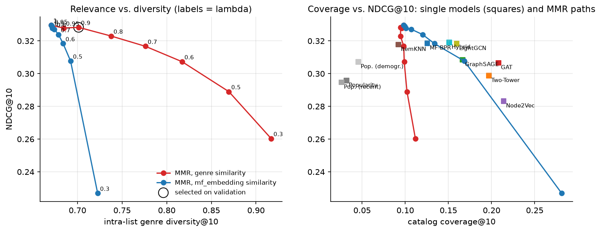

## 22. Exposure analysis

`scripts/run_reranking.py` looks at the top-10 lists of all test users and how the 8,810 slots
are distributed over the catalog:

- the Gini coefficient
- the share going to the 20% most popular movies (head)
- how many movies get any exposure
- the exposure share per popularity decile

The same statistics for what the test users actually liked after the cutoff are the reference.
This is about the behaviour of the recommender (concentration, long tail), not a fairness claim
about users or providers.

<!-- table:exposure -->
| List (top-10, 881 test users) | Gini | share of slots on head items | movies shown at least once | tail movies shown | share of slots on the 10 most shown movies |
|---|---|---|---|---|---|
| Popularity | 0.994 | 1.000 | 118 | 0 | 0.656 |
| Popularity (recent) | 0.994 | 1.000 | 97 | 0 | 0.662 |
| Popularity (demographic) | 0.991 | 1.000 | 169 | 0 | 0.506 |
| ItemKNN | 0.981 | 0.999 | 341 | 5 | 0.480 |
| MF-BPR | 0.974 | 0.993 | 523 | 47 | 0.498 |
| Two-Tower | 0.943 | 0.963 | 779 | 158 | 0.220 |
| Node2Vec | 0.957 | 0.931 | 762 | 321 | 0.449 |
| GraphSAGE | 0.958 | 0.974 | 704 | 162 | 0.449 |
| GAT | 0.954 | 0.972 | 747 | 173 | 0.442 |
| LightGCN | 0.968 | 0.991 | 585 | 66 | 0.477 |
| Hybrid (id+content+graph) | 0.970 | 0.990 | 544 | 69 | 0.365 |
| Ranker (xgb, temporal) | 0.979 | 0.998 | 363 | 14 | 0.374 |
| Ranker (xgb, temporal) + MMR (lambda=0.9) | 0.980 | 0.998 | 351 | 13 | 0.380 |
| Actual test positives | 0.697 | 0.703 | 2980 | 2239 | 0.033 |
<!-- /table:exposure -->

What the test users actually liked covers 2,980 movies with a Gini of 0.70, and 30% of the likes
go to non-head movies. Every recommender is far more concentrated:

- Popularity variants: Gini 0.99, at most 169 movies.
- Ranker: the final ranker shows only 363 movies, fewer than the hybrid retriever it re-ranks
  (544). It uses the popularity features heavily and pulls the lists further towards the head.
  Genre MMR does not change that.
- Two-tower: the least concentrated learned model (Gini 0.943, 779 movies, 3.7% of slots on
  non-head movies).
- Node2Vec: spends 6.9% of its slots outside the head. 5% of all its slots (191 different
  movies) go to movies with no training positives. These are isolated nodes whose
  embeddings were only shaped by negative samples, so this is an artifact rather than long-tail
  discovery: Node2Vec's hit rate on those movies is zero.

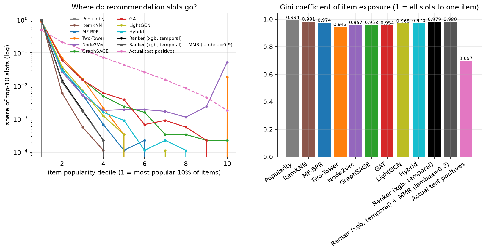

## 23. Evaluation

`src/recsysx/evaluation/`. One evaluator is used for every model:

- full ranking over all 3,706 movies, with no sampled negatives (sampled metrics can change model
  orderings, Krichene and Rendle 2020) and movies rated before the cutoff removed
- metrics are computed per user, then averaged: Recall@K = hits / number of targets, Precision@K,
  NDCG@K (ideal DCG with min(K, number of targets) hits), MAP@K, and MRR within the top 20, for
  K in {5, 10, 20}
- results per group: warm, sparse and cold users
- beyond accuracy, on the top 10: coverage, intra-list genre diversity, novelty, personalization,
  Gini of exposure and share of tail items
- trained models are run with 3 seeds (42, 43, 44) and reported as mean and standard deviation
- paired comparisons on the same users: per-user recall@20 averaged over the 3 seeds, a bootstrap
  95% confidence interval of the mean difference (2,000 resamples) and a Wilcoxon signed-rank test
- the metric functions are unit-tested against hand-computed examples (`tests/test_metrics.py`)

Recall@K here is the fraction of a user's targets found. Test users have many targets (median 35,
mean 66), so Recall@5 is capped far below 1, and NDCG@10 is larger than NDCG@20.

Resources: training times are wall-clock on an RTX 3050 6 GB laptop GPU. Latency is measured on
the CPU (Intel i5-13450HX), one request at a time. GPU memory is the peak allocated by PyTorch
during training. The GPU kernels are not fully deterministic: re-running the hybrid with the same
seeds in the ablation suite gave 0.1216 instead of 0.1224.

## 24. Main results

Test users, mean ± std over 3 seeds for the trained models:

<!-- table:main -->
| Model | Recall@10 | Recall@20 | NDCG@10 | NDCG@20 | Seeds |
|---|---|---|---|---|---|
| Popularity | 0.0601 | 0.1004 | 0.2958 | 0.2726 | 1 |
| Popularity (recent) | 0.0662 | 0.1118 | 0.2947 | 0.2793 | 1 |
| Popularity (demographic) | 0.0664 | 0.1097 | 0.3072 | 0.2873 | 1 |
| ItemKNN | 0.0669 | 0.1110 | 0.3178 | 0.2934 | 1 |
| MF-BPR | 0.0697 ± 0.0022 | 0.1143 ± 0.0023 | 0.3186 ± 0.0035 | 0.2948 ± 0.0031 | 3 |
| Two-Tower | 0.0692 ± 0.0005 | 0.1177 ± 0.0027 | 0.2988 ± 0.0045 | 0.2827 ± 0.0037 | 3 |
| Node2Vec | 0.0616 ± 0.0047 | 0.1040 ± 0.0043 | 0.2832 ± 0.0068 | 0.2637 ± 0.0036 | 3 |
| GraphSAGE | 0.0669 ± 0.0009 | 0.1123 ± 0.0010 | 0.3085 ± 0.0021 | 0.2885 ± 0.0028 | 3 |
| GAT | 0.0667 ± 0.0016 | 0.1139 ± 0.0017 | 0.3066 ± 0.0027 | 0.2861 ± 0.0018 | 3 |
| LightGCN | 0.0712 ± 0.0030 | 0.1209 ± 0.0016 | 0.3183 ± 0.0025 | 0.2982 ± 0.0019 | 3 |
| Hybrid (id+content+graph) | 0.0737 ± 0.0017 | 0.1224 ± 0.0025 | 0.3191 ± 0.0011 | 0.2988 ± 0.0014 | 3 |
<!-- /table:main -->

Paired comparisons (per-user recall@20 averaged over seeds):

<!-- table:significance -->
| A vs. B | users | mean diff. recall@20 | 95% CI | Wilcoxon p | users A better / B better |
|---|---|---|---|---|---|
| LightGCN vs. MF-BPR | all (881) | +0.0066 | [+0.0030, +0.0103] | 0.0001 | 313 / 242 |
| LightGCN vs. MF-BPR | warm (487) | +0.0081 | [+0.0023, +0.0136] | 0.0003 | 196 / 144 |
| LightGCN vs. MF-BPR | sparse (73) | +0.0261 | [+0.0067, +0.0499] | 0.0359 | 35 / 24 |
| LightGCN vs. MF-BPR | cold (321) | -0.0001 | [-0.0009, +0.0007] | 0.6203 | 82 / 74 |
| GraphSAGE vs. MF-BPR | all (881) | -0.0020 | [-0.0063, +0.0021] | 0.8282 | 286 / 299 |
| GAT vs. MF-BPR | all (881) | -0.0004 | [-0.0050, +0.0040] | 0.3648 | 294 / 314 |
| GAT vs. GraphSAGE | all (881) | +0.0015 | [-0.0024, +0.0054] | 0.9722 | 311 / 315 |
| Node2Vec vs. MF-BPR | all (881) | -0.0103 | [-0.0151, -0.0057] | 0.0000 | 302 / 358 |
| Hybrid (id+content+graph) vs. LightGCN | all (881) | +0.0015 | [-0.0027, +0.0060] | 0.8193 | 349 / 338 |
| Two-Tower vs. MF-BPR | all (881) | +0.0035 | [-0.0020, +0.0091] | 0.5444 | 341 / 372 |
| ItemKNN vs. MF-BPR | all (881) | -0.0032 | [-0.0076, +0.0012] | 0.2292 | 315 / 342 |
| Final pipeline vs. Hybrid (id+content+graph) | all (881) | +0.0101 | [+0.0060, +0.0145] | 0.0000 | 408 / 288 |
| Final pipeline vs. LightGCN | all (881) | +0.0116 | [+0.0065, +0.0172] | 0.0005 | 379 / 301 |
| Final pipeline vs. Two-Tower | all (881) | +0.0148 | [+0.0090, +0.0205] | 0.0000 | 448 / 269 |
<!-- /table:significance -->

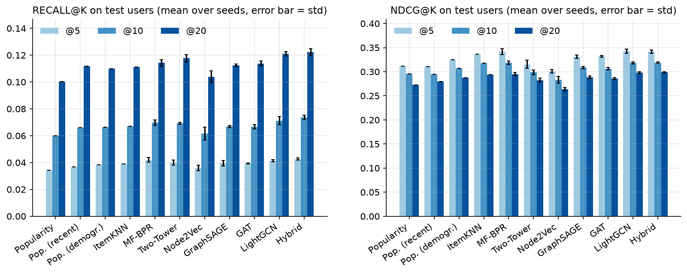

What this shows:

- The best single models are graph models with weight-free propagation.
  - LightGCN (0.1209) and the LightGCN-based hybrid (0.1224) have the highest recall@20.
  - LightGCN beats MF by +0.0066 recall@20. The 95% CI [+0.0030, +0.0103] excludes zero, and 313
    test users are better served against 242 the other way.
  - The gain is clearest for sparse users (+0.026, n = 73) and is significant for warm users.
- Learned message passing does not beat MF.
  - GraphSAGE (0.1123) and GAT (0.1139) are statistically indistinguishable from MF (0.1143), and
    from each other.
  - They took longer to train (68 s and 115 s against 46 s) and needed the debugging described in
    section 13 just to reach that level.
  - Node2Vec is significantly worse than MF (-0.010). Structure without a recommendation loss is
    not enough.
- NDCG tells a slightly different story than recall.
  - MF, LightGCN, the hybrid and ItemKNN have practically the same NDCG@10 (0.318-0.319).
  - The two-tower model has the third best recall but a clearly lower NDCG@10 (0.299). It finds
    more of the targets but orders the first positions worse.
- Strong simple baselines.
  - Recent popularity (0.1118) is within 0.003 of MF and about level with GraphSAGE (0.1123).
  - ItemKNN (0.1110) costs one second to "train".
- No model beats demographic popularity on cold users.
  - Every cold-user number is between 0.110 and 0.119, and demographic popularity is the best
    (0.1188).

The final pipeline (FAISS retrieval with the hybrid model, the strictly temporal XGBoost ranker,
MMR at lambda = 0.9) reaches recall@20 0.1325 and NDCG@10 0.3283, with genre diversity 0.701. It is
significantly better than the two best single models: +0.0101 recall@20 over the hybrid (CI
[+0.0060, +0.0145]) and +0.0116 over LightGCN (CI [+0.0065, +0.0172]). For the 73 sparse users the
difference is not significant. The pipeline with the validation-trained ranker reaches 0.1425, but part of
that gain is not achievable in deployment (section 16).

<!-- table:final -->
| Model | R@5 | R@10 | R@20 | N@5 | N@10 | N@20 | P@10 | Cov@10 | Div@10 | Nov@10 | Cold users R@20 | New items R@20 | Train (s) | Retr. ms | Rank ms | Params |
|---|---|---|---|---|---|---|---|---|---|---|---|---|---|---|---|---|
| Popularity | 0.0344 | 0.0601 | 0.1004 | 0.3113 | 0.2958 | 0.2726 | 0.2775 | 0.032 | 0.677 | 1.62 | 0.1144 | 0.0358 | 0 | n/a | n/a | 0 |
| Popularity (recent) | 0.0367 | 0.0662 | 0.1118 | 0.3107 | 0.2947 | 0.2793 | 0.2751 | 0.026 | 0.598 | 1.69 | 0.1171 | n/a | 0 | n/a | n/a | 0 |
| Popularity (demographic) | 0.0384 | 0.0664 | 0.1097 | 0.3252 | 0.3072 | 0.2873 | 0.2866 | 0.046 | 0.670 | 1.71 | 0.1188 | n/a | 0 | n/a | n/a | 0 |
| ItemKNN | 0.0389 | 0.0669 | 0.1110 | 0.3361 | 0.3178 | 0.2934 | 0.2963 | 0.092 | 0.674 | 1.95 | 0.1144 | 0.0358 | 1 | n/a | n/a | 0 |
| MF-BPR | 0.0419 | 0.0697 | 0.1143 | 0.3417 | 0.3186 | 0.2948 | 0.2954 | 0.126 | 0.669 | 1.97 | 0.1122 | 0.0483 | 46 | 0.28 | n/a | 624k |
| Two-Tower | 0.0400 | 0.0692 | 0.1177 | 0.3154 | 0.2988 | 0.2827 | 0.2797 | 0.197 | 0.615 | 2.57 | 0.1098 | 0.1260 | 73 | 0.32 | n/a | 712k |
| Node2Vec | 0.0361 | 0.0616 | 0.1040 | 0.3013 | 0.2832 | 0.2637 | 0.2629 | 0.214 | 0.679 | 2.80 | 0.1152 | 0.0379 | 94 | 0.32 | n/a | 624k |
| GraphSAGE | 0.0395 | 0.0669 | 0.1123 | 0.3312 | 0.3085 | 0.2885 | 0.2860 | 0.166 | 0.653 | 2.22 | 0.1136 | 0.0373 | 68 | 0.31 | n/a | 640k |
| GAT | 0.0393 | 0.0667 | 0.1139 | 0.3319 | 0.3066 | 0.2861 | 0.2847 | 0.208 | 0.649 | 2.36 | 0.1123 | 0.0437 | 115 | 0.37 | n/a | 628k |
| LightGCN | 0.0413 | 0.0712 | 0.1209 | 0.3425 | 0.3183 | 0.2982 | 0.2952 | 0.160 | 0.652 | 2.16 | 0.1121 | 0.0507 | 55 | 0.33 | n/a | 624k |
| Hybrid (id+content+graph) | 0.0427 | 0.0737 | 0.1224 | 0.3416 | 0.3191 | 0.2988 | 0.2960 | 0.151 | 0.647 | 2.16 | 0.1138 | 0.1356 | 42 | 0.30 | n/a | 638k |
| Final pipeline (no MMR) | 0.0468 | 0.0800 | 0.1329 | 0.3472 | 0.3296 | 0.3118 | 0.3056 | 0.098 | 0.670 | 2.06 | 0.1174 | n/a | n/a | 0.76 | 15.2 | n/a |
| Final pipeline + MMR (lambda=0.9) | 0.0467 | 0.0804 | 0.1325 | 0.3477 | 0.3283 | 0.3112 | 0.3039 | 0.095 | 0.701 | 2.05 | 0.1176 | n/a | n/a | 0.76 | 17.9 | n/a |
| Pipeline, same-period ranker (no MMR) | 0.0603 | 0.0932 | 0.1434 | 0.3696 | 0.3488 | 0.3274 | 0.3158 | 0.097 | 0.666 | 2.07 | 0.1205 | n/a | n/a | 0.76 | 15.2 | n/a |
| Pipeline, same-period ranker + MMR (lambda=0.9) | 0.0602 | 0.0930 | 0.1425 | 0.3714 | 0.3467 | 0.3259 | 0.3126 | 0.098 | 0.703 | 2.07 | 0.1201 | n/a | n/a | 0.76 | 17.9 | n/a |
<!-- /table:final -->

`n/a`: not applicable or not measured. Retrieval latency is FAISS exact search for N = 200
candidates for one user, measured inside the pipeline (0.29 ms in the isolated retrieval benchmark;
the pipeline adds Python-side filtering). Ranking latency = feature computation + XGBoost on CPU
(+ MMR for the MMR row). Training time is wall-clock until early stopping. New items R@20 comes from
the item cold-start experiment.

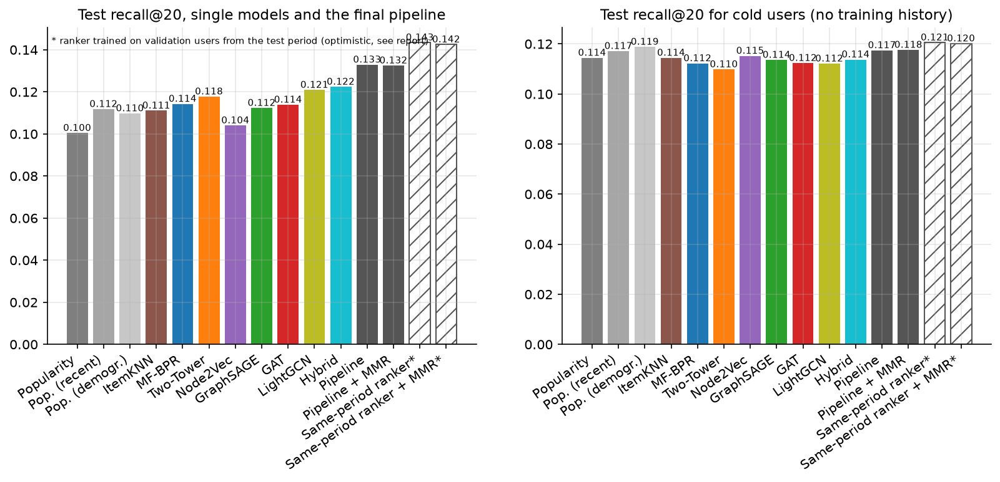

Training cost (mean of 3 seeds, RTX 3050):

| Model | Training time | Peak GPU memory |
|---|---|---|
| MF | 46 s | 68 MB |
| two-tower | 73 s | 277 MB |
| Node2Vec | 94 s | random walks on CPU |
| GraphSAGE | 68 s | 298 MB |
| GAT | 115 s | 1,028 MB |
| LightGCN | 55 s | 524 MB |
| hybrid | 42 s | 526 MB |

All models have 0.62-0.71M parameters (64-d embeddings of 9,746 nodes dominate).

The full pipeline costs 18.7 ms per request on the CPU on average (p95 22.3 ms):

- retrieval 0.8 ms
- features 8.1 ms
- XGBoost 7.1 ms
- MMR 2.7 ms

Reading the user history from PostgreSQL instead of memory takes 1.1 ms per request. The total in
that run was 19.2 ms instead of 18.7 ms, because the other stages vary by a similar amount between
runs. The recommendations are identical.

## 25. Ablations

All ablations are also collected in `results/tables/ablation_results.csv`.

1-3. MF vs. GraphSAGE vs. GAT vs. Node2Vec. See the main table and the significance table.
GraphSAGE ≈ GAT ≈ MF > Node2Vec. Attention did not give a measurable advantage over mean
aggregation (GAT - GraphSAGE = +0.0015, CI [-0.0024, +0.0054]). LightGCN > MF.

4. Graph / content / hybrid (3 seeds each, all built on the tuned LightGCN setup):

<!-- table:hybrid -->
| Variant | Recall@20 | NDCG@20 | Warm R@20 | Sparse R@20 | Cold R@20 |
|---|---|---|---|---|---|
| collaborative only (id, no graph) | 0.1140 ± 0.0004 | 0.2890 ± 0.0030 | 0.1159 ± 0.0010 | 0.1162 ± 0.0014 | 0.1107 ± 0.0002 |
| content only (no id, no graph) | 0.0927 ± 0.0020 | 0.2428 ± 0.0046 | 0.0904 ± 0.0031 | 0.0849 ± 0.0069 | 0.0978 ± 0.0009 |
| id + content (no graph) | 0.1120 ± 0.0019 | 0.2796 ± 0.0015 | 0.1141 ± 0.0032 | 0.1194 ± 0.0049 | 0.1071 ± 0.0006 |
| graph only (id + graph) | 0.1209 ± 0.0016 | 0.2982 ± 0.0019 | 0.1249 ± 0.0036 | 0.1327 ± 0.0018 | 0.1121 ± 0.0011 |
| content + graph (no id) | 0.1157 ± 0.0008 | 0.2866 ± 0.0019 | 0.1163 ± 0.0019 | 0.1106 ± 0.0047 | 0.1161 ± 0.0010 |
| hybrid (id + content + graph) | 0.1216 ± 0.0030 | 0.2998 ± 0.0019 | 0.1249 ± 0.0057 | 0.1291 ± 0.0041 | 0.1148 ± 0.0011 |
<!-- /table:hybrid -->

- Message passing is what adds accuracy. "Graph only" beats "collaborative only" by 0.007
  with the same embeddings and loss.
- Content adds nothing on top of the graph overall (0.1216 vs. 0.1209). Content alone is worse
  than all-time popularity (0.0927).
- Without ids, content + graph is the best learned model for cold users (0.1161), still below
  demographic popularity (0.1188).
- Content matters for new items, where it is the only signal (section 18).

5. Diversity re-ranking. See section 21. lambda = 0.9 (genre) costs 0.4% NDCG@10 for +0.031
genre diversity, and lambda <= 0.6 costs more than 5%.

6. Interaction-data size: see section 19.

7. Warm vs. cold users: see the user-group table in section 18. The learned models gain against
the popularity baselines only for warm and sparse users.

8. Retrieval only vs. retrieval + ranking. With 200 candidates the ranker adds:

- +0.0225 recall@20 when trained on validation users from the same period
- +0.0119 when trained strictly before the cutoff

Logistic regression adds almost nothing (+0.005).

9. Candidate count. For the hybrid retriever, candidate recall is 0.220, 0.335 and 0.482 for
50, 100 and 200 candidates (0.715 at 500). XGBoost test recall@20 grows with it: 0.1305, 0.1380 and
0.1434. Single-query FAISS latency grows slowly with N (0.27 ms at N = 20, 0.30 ms at N = 200,
0.44 ms at N = 500). The real cost of a larger N is in the ranking stage, which is linear in N.

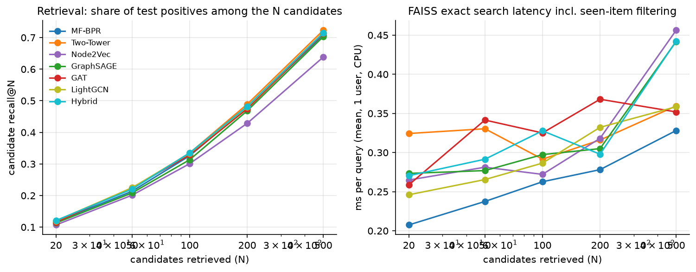

10. GNN design choices (seed 42; deeper models trained with patience 50):

<!-- table:gnn_ablation -->
| Model | Variant | Val R@20 | Test R@20 | Test warm R@20 | Test cold R@20 | Best epoch |
|---|---|---|---|---|---|---|
| GraphSAGE | selected config (main run, seed 42) | 0.1179 | 0.1132 | 0.1110 | 0.1159 | 47 |
| GraphSAGE | target edges kept in message passing | 0.1158 | 0.1118 | 0.1155 | 0.1105 | 51 |
| GraphSAGE | unknown-user row trained with edges (no cold simulation) | 0.1154 | 0.1110 | 0.1108 | 0.1103 | 47 |
| GraphSAGE | no unknown-user embedding (id dropout 0) | 0.1136 | 0.1083 | 0.1112 | 0.1047 | 32 |
| GraphSAGE | 2 layers (patience 50) | 0.1160 | 0.1140 | 0.1166 | 0.1105 | 82 |
| GraphSAGE | 3 layers (patience 50) | 0.1138 | 0.1106 | 0.1099 | 0.1115 | 52 |
| GraphSAGE | max aggregation | 0.1165 | 0.1097 | 0.1100 | 0.1092 | 23 |
| GraphSAGE | jk=last | 0.1147 | 0.1099 | 0.1096 | 0.1108 | 34 |
| GAT | selected config (main run, seed 42) | 0.1198 | 0.1157 | 0.1181 | 0.1121 | 26 |
| GAT | target edges kept in message passing | 0.1141 | 0.1139 | 0.1147 | 0.1107 | 11 |
| GAT | unknown-user row trained with edges (no cold simulation) | 0.1019 | 0.1014 | 0.1171 | 0.0713 | 22 |
| GAT | 2 layers (patience 50) | 0.1184 | 0.1195 | 0.1230 | 0.1131 | 38 |
| GAT | 3 layers (patience 50) | 0.1177 | 0.1145 | 0.1197 | 0.1090 | 30 |
| GAT | 1 head | 0.1179 | 0.1121 | 0.1140 | 0.1075 | 22 |
| LightGCN | selected config (main run, seed 42) | 0.1225 | 0.1198 | 0.1222 | 0.1130 | 16 |
| LightGCN | target edges kept in message passing | 0.1221 | 0.1200 | 0.1228 | 0.1125 | 16 |
| LightGCN | unknown-user row trained with edges (no cold simulation) | 0.1214 | 0.1229 | 0.1270 | 0.1130 | 17 |
| LightGCN | no unknown-user embedding (id dropout 0) | 0.0868 | 0.0875 | 0.1262 | 0.0192 | 16 |
| LightGCN | 2 layers (patience 50) | 0.1234 | 0.1213 | 0.1250 | 0.1130 | 22 |
| LightGCN | 3 layers (patience 50) | 0.1224 | 0.1226 | 0.1275 | 0.1126 | 39 |
<!-- /table:gnn_ablation -->

- No cold simulation: costs GAT about 0.04 recall@20 on cold users (0.071 vs. 0.112), costs
  GraphSAGE little, and LightGCN nothing. That matches the explanation in section 13.
- No unknown-user embedding: turns cold users into random recommendations (LightGCN cold
  recall 0.019).
- Target-edge removal: on the test users the difference is within ±0.002. On validation, GAT
  is 0.006 lower without the removal (0.1141 vs. 0.1198). So the removal does not hurt and may help
  a little. With one layer a user is only one hop from the target item, so the shortcut is small.
- Depth. With patience 50, the 2- and 3-layer GAT and LightGCN are within about 0.001-0.002
  of the 1-layer configs on validation. On the (single-seed) test users, the deeper LightGCN
  variants are slightly higher (0.1213 and 0.1226 vs. 0.1198), and GraphSAGE gets worse with
  3 layers. The 1-layer choice is therefore not clearly better than 2 layers; it is cheaper and
  stops earlier.

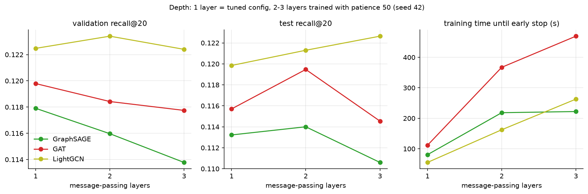

11. Ranking features (XGBoost, 200 candidates, validation-trained setting):

- without the graph-model scores: 0.1394 vs. 0.1434 with all features
- without any model scores: 0.1414
- only retrieval score + rank: 0.1206, i.e. no gain
- the hand-made pair features: no effect (0.1443)

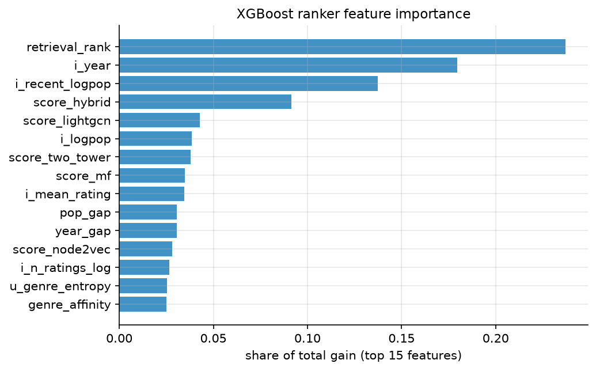

## 26. Error analysis

`scripts/run_analysis.py`, tables `results/tables/error_*.csv`, concrete cases in
`results/tables/error_examples.md` (selected by fixed rules, not by hand).

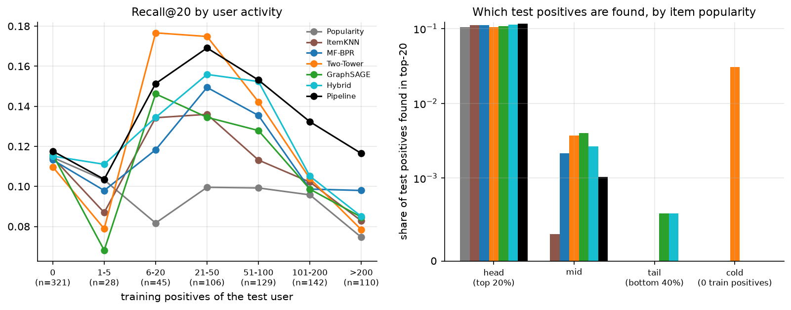

Who is hard?

- Users with 21-50 training positives are the easiest group for the final pipeline (0.169),
  LightGCN (0.160), the hybrid, MF and GAT.
- The most active users (>200 training positives, n = 110) are among the hardest (pipeline
  0.116, LightGCN 0.089, MF 0.098; only the 28 users with 1-5 positives are lower for the pipeline). The most active test user (1,209 liked movies before the cutoff) has
  226 targets, so recall@20 can reach at most 0.088. Their later likes are much less popular than
  their earlier ones: mean popularity 127 against 276, and 19% are tail movies. All models get
  0.03-0.04. Heavy users have already seen the blockbusters, and their remaining taste lies in the
  part of the catalog the models rank badly.
- Users with 1-5 training positives (n = 28): Node2Vec breaks down completely (0.003). Its
  embeddings for such users come from a handful of walks. LightGCN (0.106) and the hybrid (0.111)
  stay at popularity level.
- Narrow taste. Among warm users, splitting by the share of their likes in their top genre,
  popularity drops from 0.103 (broad) to 0.078 (narrow). The two-tower model (0.125), the hybrid
  (0.129) and the final pipeline (0.146) do not drop. Personalization pays off most for these
  users.

Which targets are missed?

- Popularity. Every model finds almost only head movies. MF's hit rate is 11.2% for head
  targets, 0.2% for the middle and 0.0% for tail targets.
- New movies. The two-tower model is the only model that finds any of the 65 test positives on
  movies with no training positives (3.1%).
- Never found. 84% of all test positives are not in the top 20 of *any* model. The long-tail
  movies missed most often are 2000 releases such as Bamboozled and Tigerland. Being released in
  2000, they had little time to collect training positives before the cutoff.

Retrieval or ranking failure? For the final pipeline:

- Head targets: 45% are never retrieved, 43% are retrieved but ranked below 20, and 11.7% are hits.
- Middle-popularity targets: 94% are never retrieved.
- Tail targets: 99.8% are never retrieved.

For anything outside the head the retriever is the bottleneck, and no ranker can fix that.

Misleading graph neighbourhoods? My hypothesis was that GraphSAGE loses against MF for users
whose movies are all blockbusters with thousands of neighbours, because their neighbourhood
averages out. The data does not support it. The per-user difference GraphSAGE - MF does not
correlate with the mean degree of the user's movies (Spearman -0.013, p = 0.76) or with the user's
own degree (p = 0.94). By degree quartile the difference is -0.006, -0.008, -0.020 and +0.007,
with no trend. I do not have a convincing per-user explanation for where GraphSAGE loses.

The clearest single case is the user with the largest GraphSAGE loss (sparse, 3 liked blockbusters,
12 test positives that are all blockbusters too). Popularity and MF score 0.42 and GraphSAGE 0.17.
For this user "recommend the most popular movies" was simply the right answer, and the 1-hop
average over three movies moved GraphSAGE away from it.

A cold user with a niche taste (user 45, no history, 33 targets, 27% of them tail movies,
mostly Horror and Thriller). The pipeline recommends Star Wars, American Beauty and Saving Private
Ryan, and only 9% of the targets are among the 200 retrieved candidates. No model gets a single hit
for this user. Nothing in this user's demographics points to horror movies.

Why do LightGCN and the hybrid ignore new users' ratings? (section 18)
`results/tables/onboarding_vector_shift.csv` shows that after 10 revealed ratings the new user's
vector still has cosine 0.993 (LightGCN) and 0.989 (hybrid) with the unknown-user vector it started
from. For GAT the value is 0.56, and for GraphSAGE 0.83. The symmetric normalisation of LightGCN
scales a neighbour by 1/sqrt(deg(u) * deg(i)). Onboarding ratings are mostly popular movies with
hundreds of neighbours, so their contribution is tiny next to the layer-0 embedding. For a model
that is meant to work inductively this is a real weakness. For trained users it does not matter,
because their layer-0 embedding is learned.

## 27. Final model selection

Selected for the integrated pipeline (`src/recsysx/pipeline.py`):

- Retriever: hybrid (LightGCN + content). It had the highest validation candidate recall@200
  (0.481). On the test users the two-tower model is marginally higher (0.489 vs. 0.482), a
  difference I would not read much into. The hybrid also handles new movies through content.
- Index: exact FAISS (`IndexFlatIP`).
  - It takes 0.29 ms per query. IVF is not faster enough to matter at this scale and loses recall:
    with nprobe 16 it finds 82% of the exact top 200.
  - HNSW with M = 32 recovers 98% but is slower (0.83 ms), because efSearch has to be at least k,
    which includes the history over-fetch.
  - An approximate index makes sense only for a much larger catalog.
- Ranker: XGBoost LambdaMART on 200 candidates, trained strictly on data before the cutoff.
  - The validation-trained XGBoost was best among the rankers and candidate counts on held-out
    validation users.
  - The strictly temporal version is what a deployed system can actually train, so that is the
    version in the pipeline.
- MMR with genre similarity, lambda = 0.9. It is cheap (-0.4% NDCG@10) and adds visible genre
  variety.
- PostgreSQL holds users, items and ratings, serves the user history at request time (+1.1 ms)
  and stores the produced recommendations (`scripts/recommend.py --to-db`).

Rejected or not selected:

- GraphSAGE and GAT: no accuracy gain over MF, more training time and debugging, and lower
  candidate recall than the hybrid.
- Node2Vec: significantly worse.
- Content-only models: worse than popularity on users.
- The neural ranker: close to XGBoost but not better on validation.
- Logistic regression: little gain.
- lambda <= 0.8: the NDCG cost grows quickly.
- Approximate indexes: see above.

Two smaller decisions I left out on purpose:

- Routing cold users to demographic popularity (0.1188 vs. 0.1176 for the pipeline) is within the
  noise.
- Mixing candidates from several retrievers would add complexity for a gain I have not measured.

## 28. Limitations

- Dataset and period. One dataset (MovieLens-1M), one time cutoff, and a period where most
  users rate in one sign-up session. On a dataset with gradual interaction histories, the group
  sizes and probably the cold-start conclusions would differ.
- Interface bias. MovieLens shows popular movies during sign-up, so part of the popularity
  bias in the targets comes from the interface. That inflates the popularity baselines,
  particularly for cold users.
- Thin content. Content is 18 genres, a year and a title. With real text (plots, tags) the
  content and hybrid models might help new items and new users much more.
- Small groups. The sparse group has only 73 test users, and the confidence intervals there are
  wide (half-widths of 0.014-0.027 in the paired tests).
- Tuning budget. The tuning budget is small (3-11 configurations per model) and
  coordinate-wise. GraphSAGE/GAT have more knobs than MF, so a larger search could favour them
  somewhat. The depth ablation shows that the patience setting interacts with the selected number
  of layers.
- Single seed for some experiments. Item cold-start, onboarding, the GNN design ablation,
  retrieval, ranking and the significance tests of the pipeline use seed 42 only, and GPU training
  is not bitwise reproducible.
- Ranker labels. The validation-trained ranker uses labels from the test period (quantified in
  section 16). The strictly temporal ranker is trained on a window (Nov 2000) that is dominated by
  sign-up sessions, which is a different population than the test window.
- Offline only. All evaluation is offline. Recall against held-out ratings cannot say whether
  users would have liked the movies the models recommend that they never rated.
- No approximate retrieval needed. The catalog has 3,706 items, so the FAISS experiments show
  correctness and the latency of exact search, not the scaling behaviour an approximate index is
  built for.

## 29. Conclusion

The main question was whether graph-based representation learning improves recommendation and
cold-start performance compared with conventional collaborative filtering. On MovieLens-1M:

Overall: yes, but only one kind of graph model.

- LightGCN-style propagation, with no learned weights or nonlinearity, beats MF-BPR by +0.0066
  recall@20, a 6% relative gain that is statistically significant. It is the best single model
  together with its content hybrid.
- GraphSAGE and GAT, with learned transformations, end up at MF level after considerable debugging.
  Attention brings no measurable advantage over mean aggregation.
- Node2Vec embeddings, without a recommendation loss, are worse than MF.

The useful part of "graph" here is the smoothing of the embeddings over neighbours. On a graph
where every user is two hops from almost every other user, more expressive message passing has
little to add.

Sparse data: graph propagation helps more as data gets sparser.

- With 10% of the training positives, MF keeps 78% of its recall, LightGCN 83%, GAT 86% and the
  hybrid 88%.
- At 10%, the hybrid is the only learned model clearly above plain popularity (0.107 vs. 0.098),
  and LightGCN is barely above it.
- For sparse users in the full data, LightGCN's advantage over MF is the largest (+0.026).

Cold-start: no.

- For users with no history, every model is between 0.110 and 0.119 recall@20, and demographic
  popularity is the best.
- For new users who reveal ratings, the inductive GAT and the fold-in of MF / ItemKNN / Node2Vec
  improve clearly by 10 ratings. LightGCN and the hybrid barely move, because their normalisation
  drowns the new edges, and one revealed rating makes almost every personalized model worse than
  popularity.
- For new items, content is what helps (hybrid and two-tower). The graph adds little, and no model
  gets new movies into the top of the full ranking.

Diversity, coverage, exposure. All models are far more concentrated on popular movies than the
users' actual consumption. The two-tower model covers the catalog best. The learned ranker
improves accuracy but narrows the lists further. Genre MMR adds genre variety at almost no cost but
does not change exposure. Embedding-based MMR does increase coverage, at a 6.6% NDCG cost at
lambda = 0.5.

Cost. LightGCN trains only slightly slower than MF (55 s vs. 46 s) and needs no extra tuning. GAT is the most
expensive model (115 s, 1 GB of GPU memory) for no gain. The full two-stage pipeline answers a
request in about 19 ms on a laptop CPU.

What I would do in practice. I would use LightGCN-style propagation instead of plain MF as the
retrieval model: a cheap, measurable gain, especially for sparse users. I would add content if new
items matter, and put a ranker on top that is trained on the most recent past window. I would not
expect GraphSAGE/GAT to pay for their complexity on data like this, and I would not expect any of
these models to solve user cold-start. For that, the system needs to ask new users for ratings and
use them, which the inductive GAT and simple ItemKNN do best after about 5-10 ratings.
